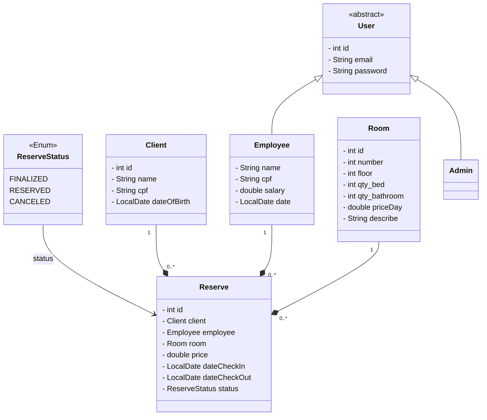

# Projeto API REST para Reservas de Hotel na Nuvem

Este projeto consiste em uma API REST para gerenciamento de reservas de hotel, desenvolvida como parte do laboratório final do Bootcamp Java do Santander, oferecido pela DIO.

## Diagrama UML do Domínio da API

